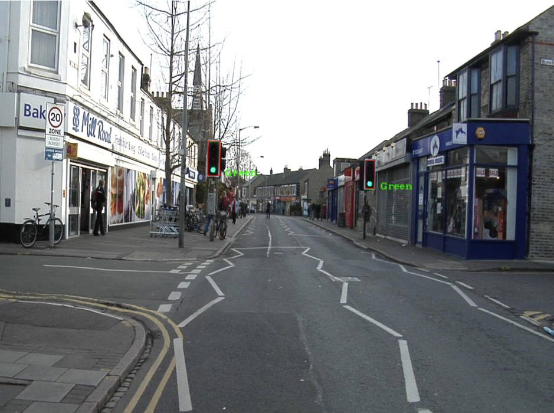

This program used thresholding, contour search and statistical pattern recognition to locate 25 of 30 traffic lights. The body of a traffic light box consists of a dark box surrounded by a white line. Their shape, color and contour hierarchy are also all largely homogenous. These distinguishing features that can be exploited to locate their presence and state in images.

The procedure produced 25 true positives, 4 false positives and 5 false negatives. It recognised 19 traffic lights correctly. This equates to a precision of 86.2% , a recall of 83%, an accuracy of 88%, and a DICE ratio of 85%. It correctly found the correct state of 63% traffic lights. See images 1 - 20 in the attached PDF.

The TrafficLightRecognition pdf contains all of the images tested and the details on the process used to find and classify the lights, I have included an example output image below: 

 

